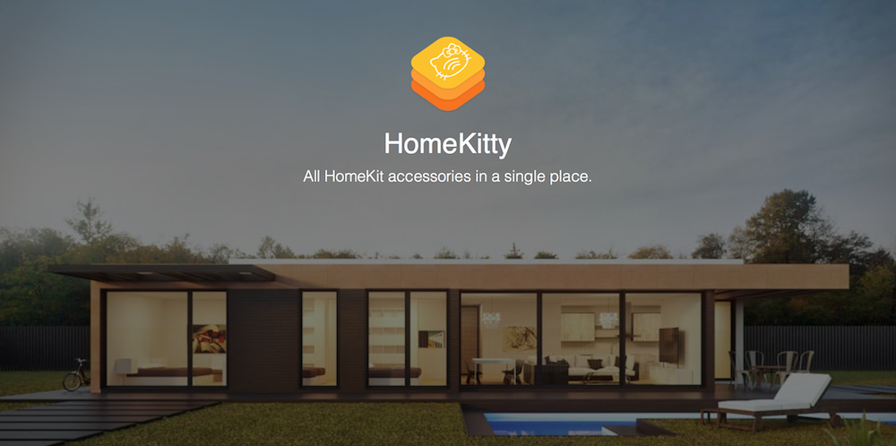

<p align="center">
    
</p>
<p align="center">
  <a href="https://circleci.com/gh/BalestraPatrick/HomeKitty">
    
  </a>
  <a href="https://swift.org">
    
  </a>  <a href="https://github.com/BalestraPatrick/HomeKitty/blob/master/LICENSE.md">
    
  </a>
</p>

# HomeKitty
HomeKitty is a website built in [Vapor 2][1] that keeps track of all HomeKit accessories available in the market. Accessories are divided in 18 official categories to make it easier to find the perfect accessory for your needs. You can search any accessory by its name or manufacturer and directly open its official website to find more information.

## Getting Started
To get started with HomeKitty, make sure you have installed Vapor on your machine. Please follow the [official guide][2]. Make sure to also install PostreSQL since HomeKitty uses it as database. [Postgres app][3] should work fine.

Enough with the dependencies, clone the repo.

```bash
$ git clone https://github.com/BalestraPatrick/HomeKitty
```
You can now choose to build via command line, or use Xcode. Who doesn't love Xcode? 🛠

- Terminal: `vapor build && vapor run serve`
- Xcode: `vapor xcode -y` and then `CMD+r`.

You will need to add some API keys as environment variables for the project to run successfully. If you're using Xcode, you can do it from the scheme menu. If you're not using Xcode, define them as environment variables. Here are the required variables:

- `STRIPE_API_KEY` can be any non-empty string.
- `DB_HOSTNAME`, `DB_USER`, `DB_PASSWORD`, `DB_DATABASE` should point to the PostgreSQL database that you have created locally. Only creating the database should be enough, Vapor will take care of generating all the needed tables when compiled for the first time. 

## Architecture
HomeKitty has a very simple architecture. The `Sources` folder contains two folders:

- Run: contains `main.swift` and it's the starting point of the application.
- App: contains all the controllers (route handlers), models and helper methods.

There are some basic tests in the Tests folder. 

## Contributing
We would love to have you onboard and help us shape the future of HomeKitty. We have a ton of new features and bug fixes ready for you in the [issues][4].

In case you need help or simply have a technical question, join us in the #development channel in our [Slack][5].

## Database
All accessories are stored in a PostgreSQL database. If you are interested in contributing with new accessories which are release everyday, let me know and we can try to find a solution and open them up to the community to improve the database.

During development, it's possible to seed the database with some example data for debugging purposes. Execute the `seed.sh` in the Scripts folder:

```bash
$ ./Scripts/seed.sh
```

## Author

I'm [Patrick Balestra][6].
Email: [me@patrickbalestra.com][7]
Twitter: [@BalestraPatrick][8].

## License

`HomeKitty` is available under the MIT license. See the [LICENSE][9] file for more info. 
Please don't re-publish the project as it is under your name. Feel free to use it a starting point for any of your other side projects though.


[1]:	https://github.com/vapor/vapor
[2]:	https://docs.vapor.codes/2.0/getting-started/install-on-macos/
[3]:	http://postgresapp.com
[4]:	https://github.com/BalestraPatrick/HomeKitty/issues
[5]:	https://homekitty-slack.herokuapp.com
[6]:	http://www.patrickbalestra.com
[7]:	mailto:me@patrickbalestra.com
[8]:	http://twitter.com/BalestraPatrick
[9]:	LICENSE